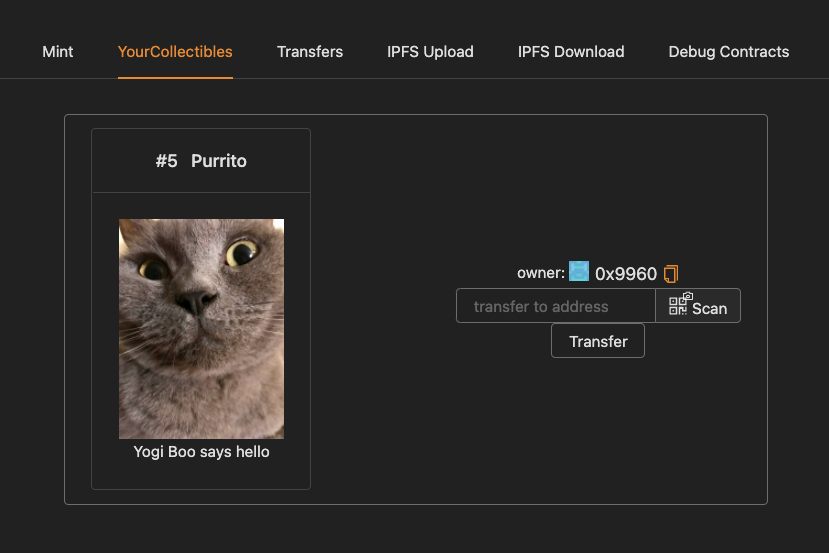

# 🐈‍⬛ Yogi Boo NFT 🐈‍⬛

The [Yogi Boo NFT collection](https://rinkeby.rarible.com/collection/0x76967580ce18c85df3b9bf699a92fa2c6b9e8c4c/items) is finally here!

> mint, and send around your own ERC721!

The goal of this collection of NFTs is to have fun AND offer everyone the possibility to mint and claim a NFT with my beautiful british shorthair cat `Yogi Boo`

## How to mint

- 🚀🚀 [OPEN MINT APP](https://yogi-boo-nft.netlify.app/) 🚀🚀

- The collection is currently available on [ Rinkeby testnet ](https://rinkeby.etherscan.io/)

- Connect with your metamask wallet to Rinkeby

- ️You'll need to get some funds from any of the publicly available faucets for gas ⛽

- Press the `mint` button to start the mint transaction.

- Once your NFT is minted it will appear in "your collectibles" tab

  

- You can also login to your [Rarible](https://rinkeby.rarible.com) account and trade it there 💰💰
